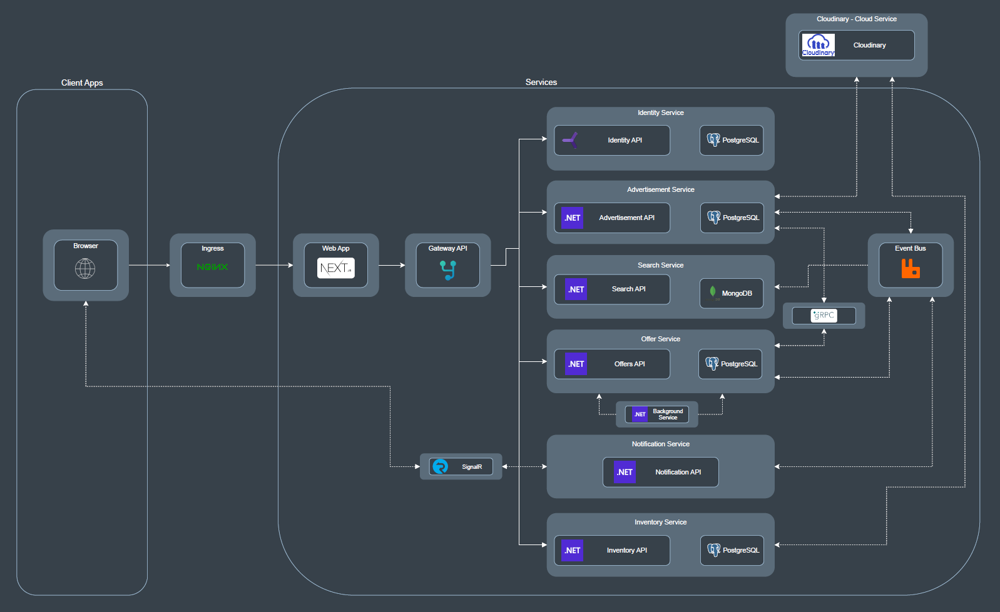
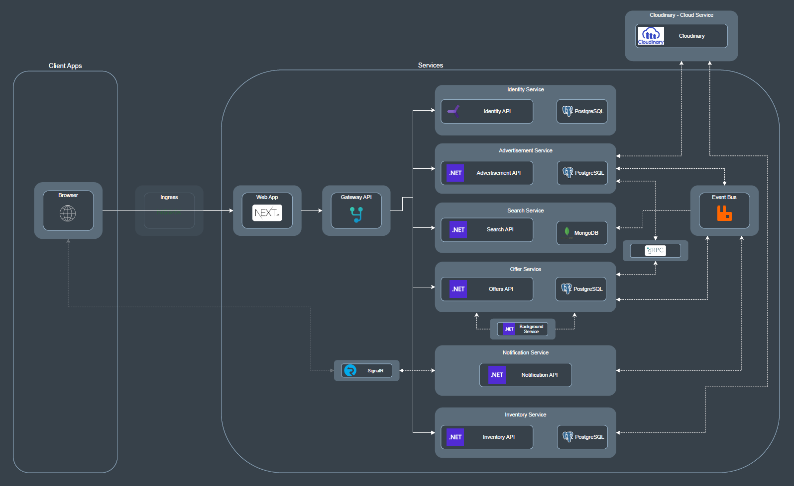

# Microservices solution - "NextChapter"

A .NET and React/Next.js based solution implementing a website for selling used books using a services-based architecture. 
This app demonstrates my ability to integrate different tools and present an easily scalable solution.

## About this repository

This is a repository where I try to put into practice all the new knowledge I gain. Much of the motivation for developing this training project came from online courses where I acquired knowledge, which, in one way or another — some more than others — helped me in different parts of this project. The courses were the following:
 - [Build a Microservices app with .Net and Nexjs from scratch - Udemy, Neil Cummings](https://www.udemy.com/course/build-a-microservices-app-with-dotnet-and-nextjs-from-scratch) (Completed on August 2024)
 - [Complete guide to building an app with .Net Core and React - Udemy, Neil Cummings](https://www.udemy.com/course/complete-guide-to-building-an-app-with-net-core-and-react)
 - [React - The Complete Guide 2023 (incl. Next.js, Redux) - Udemy, Maximilian Schwarzmüller](https://www.udemy.com/course/react-the-complete-guide-incl-redux)
 - [Docker and Kubernetes: The Complete Guide - Udemy, Stephen Grider](https://www.udemy.com/course/docker-and-kubernetes-the-complete-guide)
 - [C# COMPLETO Programação Orientada a Objectos + Projetos - Udemy, Nelio Alves](https://www.udemy.com/course/programacao-orientada-a-objetos-csharp) (Completed on September 2021)
 - [The Complete JavaScript Course 2021: From Zero to Expert! - Udemy, Jonas Schmedtmann](https://www.udemy.com/course/the-complete-javascript-course) (Completed on September 2021)

## About the solution

In the backend, where I have more experience, the desired goals have already been achieved. The frontend, which I'm improving step by step, has a good amount of work done, but there is still more to do. So, this is not a finished product, but it already demonstrates significant knowledge.     

Below are figures that illustrate the developed service-based architecture:

Goal:

Currently:

Each service was designed following the Clean Architecture philosophy, using the CQRS and Mediator design patterns. This approach allowed me to develop services in an organized manner, with clean code and high scalability. 

At the solution level, four different API protocol types were used:
 - REST: For the endpoints access of each services;
 - AMQP: An event bus with RabbitMQ as message broker for a more frequently, non coupled and asynchronous communication between services;
 - gRPC: For direct communication between two services;
 - Websockets: For a full duplex connection to achieve real-time communication between the server and the client. (client side part not implemented yet)

### Services description
#### Advertisement service

Authenticated users can create, update or delete advertisements. 
This service integrates with a third-party service called ‘Cloudinary’, where photos uploaded by users are stored. 
It acts as both publisher and subscriber to the event bus. Wherever an advertisement is created, updated or deleted, a message is published to the event bus. This service subscribes to message queues used by the offer service when an offer is placed, change state or is deleted so that it can react properly to these events.

#### Search service

All users can view all live advertisements on the homepage, where this service is used. 
It acts as a subscriber to message queues used by the advertisement service when an advertisement is created, updated or deleted so that it can maintain data consistency.

#### Inventory service

Authenticated users can view, add, update or delete items to their inventory.  
This service integrates with a third-party service called ‘Cloudinary’, where each item photo uploaded by users is stored.

#### Offer service

Authenticated users can view, create, update or delete offers. When creating an offer, users can specify whether they want to purchase with a certain amount or make an exchange with books from their inventory. 
It acts as both publisher and subscriber to the event bus. Wherever an offer is created, updated or deleted, a message is published to the event bus. This service subscribes to a message queue used by the advertisement service when an advertisement is deleted so that it can react properly to this event. 
It hosts a background service that checks for offers in pending state that have passed a certain date, if found, the service it will mark the offers as rejected.  
Additionally, it uses gRPC during offer creation, so that it can ask the advertisement service if the advertisement mentioned in the offer still available and live.

#### Identity service

This service is based on the [Duende IdentityServer](https://duendesoftware.com/products/identityserver) project with minimal modifications. It is used to store user data and issue tokens, which other services then use to validate tokens as needed.

#### Notification service

This service exposes an endpoint that allows clients to establish a full-duplex connection, enabling real time functionality with the help of the SignalR tool. 
It subscribes to message queues used by the advertisement and offer services when an advertisement is deleted and an offer is placed. The goal is to send a message to a SignalR Hub whenever these actions occur so that it can alert the connected clients. 

#### Gateway service

This service is based on the .NET YARP gateway library, and I used it to provide clients with a single endpoint for interacting with the backend. It verifies user authentication when required by the request before it transforms and redirects the request to the appropriate microservice.

### Tools used

 - ASP.NET Core
 - Entity Framework Core
 - React/Next.js
 - PostgreSQL
 - MongoDB
 - gRPC
 - SignalR
 - RabbitMQ
 - MassTransit
 - Cloudinary
 - YARP
 - Duende IdentityServer
 - Docker

## Author
Pedro Nuno Miranda
