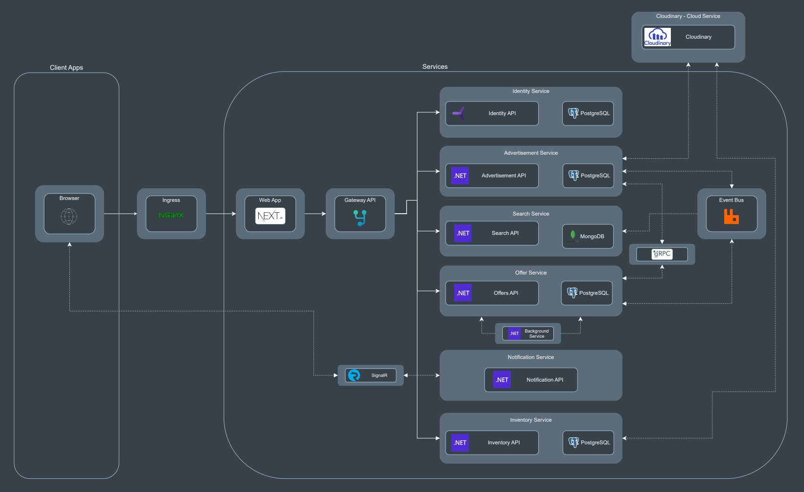
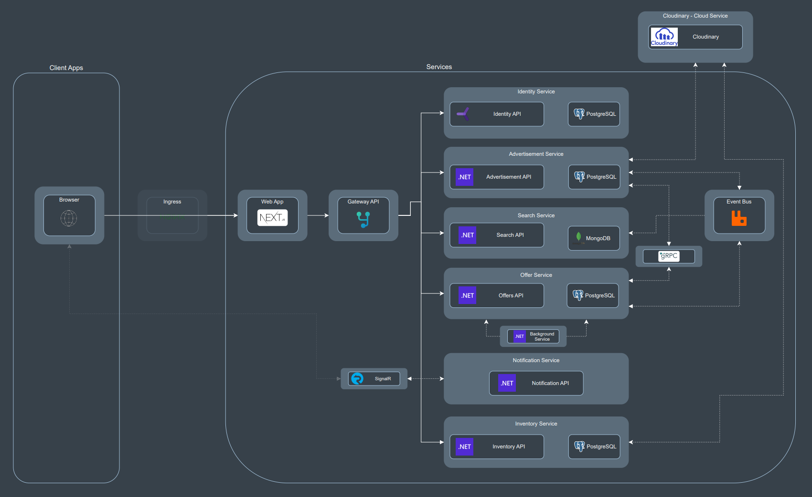

# Microservices solution - "NextChapter"

A .NET and React/Next.js based solution implementing a website for selling used books using a services-based architecture. 
Despite its size, this app demonstrates my ability to integrate different tools and present an easily scalable solution.

## About this repository

This is a repository where I try to put into practice all the new knowledge I gain. Much of the motivation for developing this training project came from online courses where I acquired knowledge, which, in one way or another — some more than others — helped me in different parts of this project. The courses were the following:
 - Build a Microservices app with .Net and Nexjs from scratch - Udemy, Neil Cummings (Completed on August 2024)
 - Complete guide to building an app with .Net Core and React - Udemy, Neil Cummings
 - React - The Complete Guide 2023 (incl. Next.js, Redux) - Udemy, Maximilian Schwarzmüller
 - Docker and Kubernetes: The Complete Guide - Udemy, Stephen Grider
 - C# COMPLETO Programação Orientada a Objectos + Projetos - Udemy, Nelio Alves (Completed on September 2021)
 - The Complete JavaScript Course 2021: From Zero to Expert! - Udemy, Jonas Schmedtmann (Completed on September 2021)

The backend, where I have the most experience, is practically finished. The frontend, which I am improving step by step, already has a good amount of work done, but there is still more to do. So, this is not a finished product, but it already demonstrates a lot of knowledge.     

Below are figures to help you understand the whole solution:

Goal:

Currently:

Home page:

## About the solution

Each service was designed following the Clean Architecture philosophy, using the CQRS and Mediator design patterns. This approach allowed me to develop services in an organized manner, with clean code and high scalability. 

At the solution level, four different API protocol types were used:
 - REST: For the endpoints access of each services;
 - AMQP: An event bus with RabbitMQ as message broker for a more frequently, non coupled and asynchronous communication between services;
 - gRPC: For direct communication between two services;
 - Websockets: For a full duplex connection to achieve real-time communication. (client side part not implemented yet)

### Services description
#### 

### Tools used

#### .NET tools

## Author
Pedro Nuno Miranda
